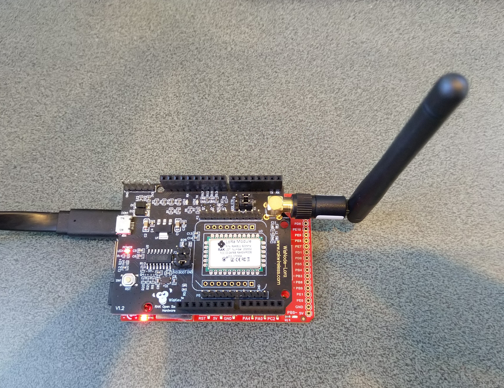

# RAK811LoRaWAN-TinyCLR
A C# library for [LoRaWAN](https://lora-alliance.org/about-lorawan) connectivity for [RAKwireless](https://www.rakwireless.com/en-us) [RAK811 Module](https://store.rakwireless.com/products/rak811-lpwan-module) equipped [GHI Electronics TinyCLR](https://www.ghielectronics.com/tinyclr/) powered devices.

The repo has the source code for the series of blog posts written as I built this library. This library is based on my [.NET nanoFramework RAK811 LoRaWAN library](https://github.com/KiwiBryn/RAK811LoRaWAN-NetNF)

01. [Basic connectivity](https://blog.devmobile.co.nz/2020/07/13/tinyclr-os-v2-rc1-rak811-lorawan-library-part1/)
02. [Nasty OTAA connect](https://blog.devmobile.co.nz/2020/07/14/tinyclr-os-v2-rc1-rak811-lorawan-library-part2/)

